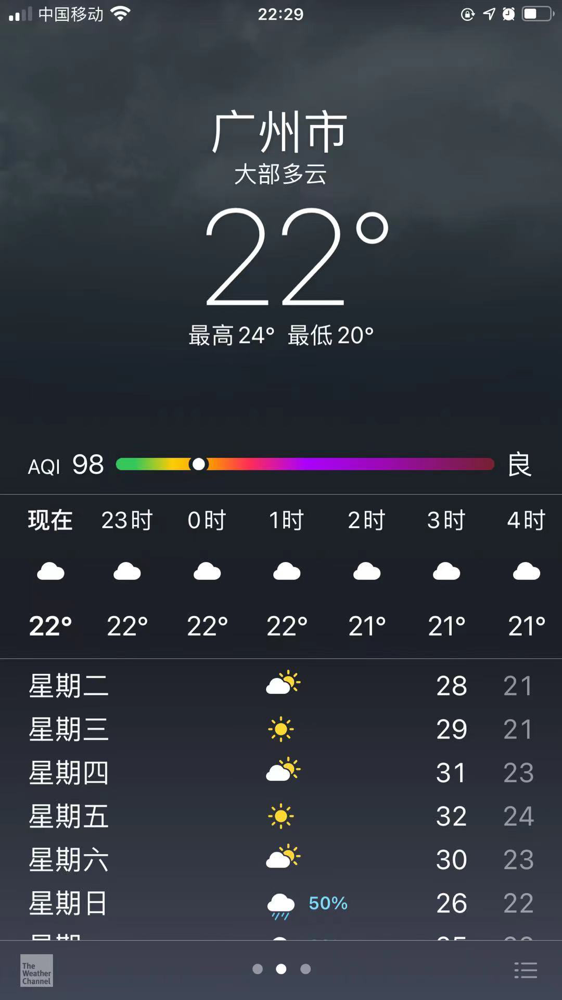
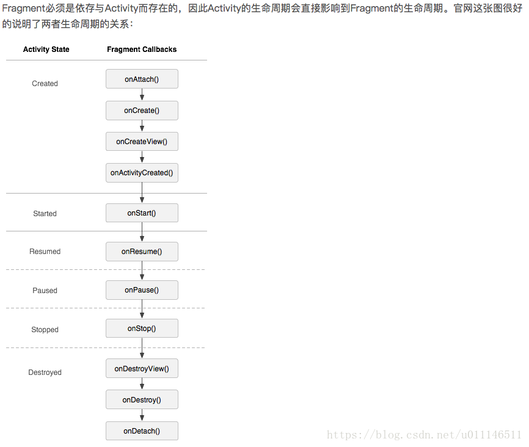
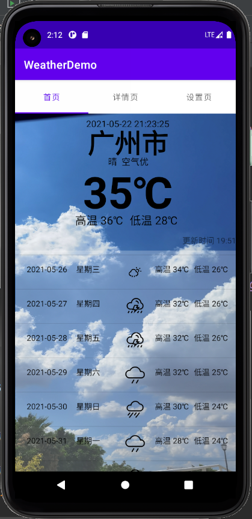

# android Weather 学习笔记

设计一个天气预报APP



1. 首页（显示首选城市的天气预报信息，大字体、大图标显示）
2. 详情页（显示未来几天的天气预报和基本信息，如：高温、低温风向等）
3. 设置页，可以管理：增加和删除不同的城市（使用sqlite存储城市名和代码）
       可以添加关注城市（用户进入时加载）
4. 使用对应的天气图标/文字/颜色等元素显示天气预报
5. 可以参考国家气象局天气数据接口或其他的接口
6. 可以根据自己的设计增加更多的功能
7. 需要提供整个可编译和运行的工程
   接口和请求数据参考：  
   https://www.cnblogs.com/dyhao/p/11942563.html  
   http://t.weather.itboy.net/api/weather/city/101280101  
   请求未来15天内天气  
   http://t.weather.itboy.net/api/weather/city/101280101  
   当天基础天气接口  
   http://www.weather.com.cn/data/sk/101280101.html  
   http://www.weather.com.cn/data/cityinfo/101280101.html  

***

参考博客：

1、[ViewPager 详解（一）---基本入门_启舰-CSDN博客_viewpager](https://blog.csdn.net/harvic880925/article/details/38453725)  

2、[fragment中嵌套viewpager，vierpager中有多个fragment，不显示 ..._mybook1122的专栏-CSDN博客_fragment嵌套viewpager](https://blog.csdn.net/mybook1122/article/details/24003343)

3、[Fragment和ViewPager的介绍和使用_方法 (sohu.com)](https://www.sohu.com/a/421658765_100109711)  

4、[ViewPager的使用_汪星没有熊的博客-CSDN博客_viewpager使用](https://blog.csdn.net/weixin_45697390/article/details/104515491)  

5、[Android：ViewPager \ViewPager2 简单介绍 & 使用方法解析_JMW1407的博客-CSDN博客_viewpager2](https://blog.csdn.net/JMW1407/article/details/114273649)  

6、[android之fragment与fragment、activity与activity、fragment与activity之间的通信_代码解释生活-CSDN博客](https://blog.csdn.net/u011146511/article/details/80485362)



Q1：如何在fragment的里面在不触发什么button的情况下，更改控件的信息？

​	最开始想的是使用onAttach()，但是会发现他要和Activity一起生成，就是说要依赖这个Activity，那可不就是百搭嘛？根本就没有解决问题，因为从Activity也是刚刚才启动，信息都是空的，返回来的值也是空。

​	因此目光转向使用onResume()。事实证明也不太可，看7这个链接就知道勒！

7、[关于Fragment中的onResume方法_AndyYuan317的博客-CSDN博客_fragment onresume](https://blog.csdn.net/qq_42618969/article/details/82014498)

8、[android开发：Looper.getMainLooper()_s297165331的专栏-CSDN博客_android getmainlooper](https://blog.csdn.net/s297165331/article/details/56484923)

```java
把
Handler mainHandler = new Handler(getMainLooper());
改成
Handler mainHandler = new Handler(Looper.getMainLooper());
效果大大滴好
```

***

1、再次学习json数据解析----心疼自己，抱紧自己

[解析JSON数据-JSONObject以及GSON_Loveyy-CSDN博客_gson jsonobject](https://blog.csdn.net/ly160507/article/details/111604817?ops_request_misc=%7B%22request%5Fid%22%3A%22162106819616780265446526%22%2C%22scm%22%3A%2220140713.130102334.pc%5Fall.%22%7D&request_id=162106819616780265446526&biz_id=0&utm_medium=distribute.pc_search_result.none-task-blog-2~all~first_rank_v2~rank_v29-2-111604817.pc_search_result_hbase_insert&utm_term=Android的jsonobject没有fromjson函数)

（插入题外话：访问全局资源的时候，必须要传递Context对象；全局资源代表：res文件夹下的内容；）

范例一：

```java
{
  "code": "200",
  "updateTime": "2020-12-24T09:52+08:00",
  "fxLink": "http://hfx.link/2bc4",
  "now": {
    "pubTime": "2020-12-24T09:00+08:00",
    "aqi": "199",
    "level": "4",
    "category": "中度污染",
    "primary": "PM2.5",
    "pm10": "124",
    "pm2p5": "149",
    "no2": "94",
    "so2": "11",
    "co": "1.5",
    "o3": "10"
  },
	"station": [
    {
      "pubTime": "2020-12-24T09:00+08:00",
      "name": "浦东张江",
      "id": "CNA1150",
      "aqi": "172",
      "level": "4",
      "category": "中度污染",
      "primary": "PM2.5",
      "pm10": "96",
      "pm2p5": "130",
      "no2": "101",
      "so2": "12",
      "co": "1.4",
      "o3": "5"
    }
    ]
}
```

范例二：

```java
{
    "error": 0,
    "status": "success",
    "results": [
        {
            "currentCity": "青岛",
            "index": [
                {
                    "title": "穿衣",
                    "zs": "较冷",
                    "tipt": "穿衣指数",
                    "des": "建议着厚外套加毛衣等服装。年老体弱者宜着大衣、呢外套加羊毛衫。"
                },
                {
                    "title": "紫外线强度",
                    "zs": "中等",
                    "tipt": "紫外线强度指数",
                    "des": "属中等强度紫外线辐射天气，外出时建议涂擦SPF高于15、PA+的防晒护肤品，戴帽子、太阳镜。"
                }
            ]

        }
    ]
}

```

但是！！我要处理的是这种：⬇

```java
{
  "message": "success感谢又拍云(upyun.com)提供CDN赞助",
  "status": 200,
  "date": "20210519",
  "time": "2021-05-19 17:30:00",
  "cityInfo": {
    "city": "广州市",
    "citykey": "101280101",
    "parent": "广东",
    "updateTime": "16:16"
  },
  "data": {
    "shidu": "56%",
    "pm25": 14.0,
    "pm10": 29.0,
    "quality": "优",
    "wendu": "37",
    "ganmao": "各类人群可自由活动",
    "forecast": [
      {
        "date": "19",
        "high": "高温 34℃",
        "low": "低温 26℃",
        "ymd": "2021-05-19",
        "week": "星期三",
        "sunrise": "05:44",
        "sunset": "19:03",
        "aqi": 16,
        "fx": "南风",
        "fl": "3级",
        "type": "雷阵雨",
        "notice": "带好雨具，别在树下躲雨"
      },
      {
        "date": "20",
        "high": "高温 34℃",
        "low": "低温 26℃",
        "ymd": "2021-05-20",
        "week": "星期四",
        "sunrise": "05:44",
        "sunset": "19:03",
        "aqi": 12,
        "fx": "南风",
        "fl": "3级",
        "type": "多云",
        "notice": "阴晴之间，谨防紫外线侵扰"
      },
      {
        "date": "21",
        "high": "高温 34℃",
        "low": "低温 27℃",
        "ymd": "2021-05-21",
        "week": "星期五",
        "sunrise": "05:43",
        "sunset": "19:04",
        "aqi": 15,
        "fx": "南风",
        "fl": "3级",
        "type": "雷阵雨",
        "notice": "带好雨具，别在树下躲雨"
      },
      {
        "date": "22",
        "high": "高温 34℃",
        "low": "低温 27℃",
        "ymd": "2021-05-22",
        "week": "星期六",
        "sunrise": "05:43",
        "sunset": "19:04",
        "aqi": 16,
        "fx": "南风",
        "fl": "3级",
        "type": "多云",
        "notice": "阴晴之间，谨防紫外线侵扰"
      },
      {
        "date": "23",
        "high": "高温 34℃",
        "low": "低温 27℃",
        "ymd": "2021-05-23",
        "week": "星期日",
        "sunrise": "05:43",
        "sunset": "19:05",
        "aqi": 17,
        "fx": "东南风",
        "fl": "3级",
        "type": "雷阵雨",
        "notice": "带好雨具，别在树下躲雨"
      },
      {
        "date": "24",
        "high": "高温 35℃",
        "low": "低温 28℃",
        "ymd": "2021-05-24",
        "week": "星期一",
        "sunrise": "05:42",
        "sunset": "19:05",
        "aqi": 34,
        "fx": "东南风",
        "fl": "2级",
        "type": "多云",
        "notice": "阴晴之间，谨防紫外线侵扰"
      },
      {
        "date": "25",
        "high": "高温 35℃",
        "low": "低温 28℃",
        "ymd": "2021-05-25",
        "week": "星期二",
        "sunrise": "05:42",
        "sunset": "19:06",
        "aqi": 37,
        "fx": "东北风",
        "fl": "3级",
        "type": "多云",
        "notice": "阴晴之间，谨防紫外线侵扰"
      },
      {
        "date": "26",
        "high": "高温 32℃",
        "low": "低温 26℃",
        "ymd": "2021-05-26",
        "week": "星期三",
        "sunrise": "05:42",
        "sunset": "19:06",
        "aqi": 27,
        "fx": "东风",
        "fl": "3级",
        "type": "多云",
        "notice": "阴晴之间，谨防紫外线侵扰"
      },
      {
        "date": "27",
        "high": "高温 31℃",
        "low": "低温 26℃",
        "ymd": "2021-05-27",
        "week": "星期四",
        "sunrise": "05:42",
        "sunset": "19:06",
        "aqi": 25,
        "fx": "东南风",
        "fl": "3级",
        "type": "多云",
        "notice": "阴晴之间，谨防紫外线侵扰"
      },
      {
        "date": "28",
        "high": "高温 33℃",
        "low": "低温 26℃",
        "ymd": "2021-05-28",
        "week": "星期五",
        "sunrise": "05:42",
        "sunset": "19:07",
        "aqi": 27,
        "fx": "东南风",
        "fl": "2级",
        "type": "中雨",
        "notice": "记得随身携带雨伞哦"
      },
      {
        "date": "29",
        "high": "高温 28℃",
        "low": "低温 24℃",
        "ymd": "2021-05-29",
        "week": "星期六",
        "sunrise": "05:41",
        "sunset": "19:07",
        "aqi": 26,
        "fx": "南风",
        "fl": "2级",
        "type": "阴",
        "notice": "不要被阴云遮挡住好心情"
      },
      {
        "date": "30",
        "high": "高温 26℃",
        "low": "低温 24℃",
        "ymd": "2021-05-30",
        "week": "星期日",
        "sunrise": "05:41",
        "sunset": "19:08",
        "aqi": 14,
        "fx": "西风",
        "fl": "2级",
        "type": "中雨",
        "notice": "记得随身携带雨伞哦"
      },
      {
        "date": "31",
        "high": "高温 27℃",
        "low": "低温 24℃",
        "ymd": "2021-05-31",
        "week": "星期一",
        "sunrise": "05:41",
        "sunset": "19:08",
        "aqi": 20,
        "fx": "东北风",
        "fl": "2级",
        "type": "小雨",
        "notice": "雨虽小，注意保暖别感冒"
      },
      {
        "date": "01",
        "high": "高温 29℃",
        "low": "低温 24℃",
        "ymd": "2021-06-01",
        "week": "星期二",
        "sunrise": "05:41",
        "sunset": "19:09",
        "aqi": 11,
        "fx": "东风",
        "fl": "2级",
        "type": "大雨",
        "notice": "出门最好穿雨衣，勿挡视线"
      },
      {
        "date": "02",
        "high": "高温 26℃",
        "low": "低温 23℃",
        "ymd": "2021-06-02",
        "week": "星期三",
        "sunrise": "05:41",
        "sunset": "19:09",
        "aqi": 30,
        "fx": "东风",
        "fl": "2级",
        "type": "中雨",
        "notice": "记得随身携带雨伞哦"
      }
    ],
    "yesterday": {
      "date": "18",
      "high": "高温 33℃",
      "low": "低温 26℃",
      "ymd": "2021-05-18",
      "week": "星期二",
      "sunrise": "05:45",
      "sunset": "19:02",
      "aqi": 37,
      "fx": "西南风",
      "fl": "2级",
      "type": "小雨",
      "notice": "雨虽小，注意保暖别感冒"
    }
  }
}
```

期间为了方便打印我的数据，我还装了lombok插件

[android studio 配置 Lombok 插件 -具体步骤 - 岑惜 - 博客园 (cnblogs.com)](https://www.cnblogs.com/c2g5201314/p/14646120.html)

此使此刻--2021/5/22--20:50	分享喜悦

